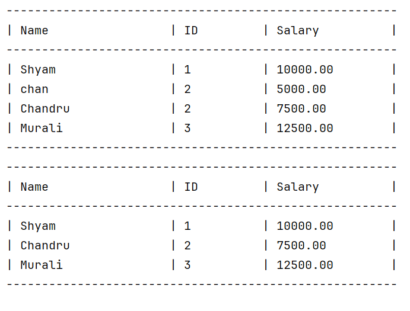

# 🏢 Employee Payroll System



In this comprehensive Java project, we dive into the exciting world of Object-Oriented Programming (OOPS) by building an Employee Payroll System from scratch. This project is designed to enhance your Java programming skills and solidify your understanding of fundamental OOP concepts.

## 🔥 What I Learnt 🔥
- ✅ Designing an Employee Payroll System using OOP principles.
- ✅ Creating abstract classes, concrete subclasses, and implementing inheritance.
- ✅ Understanding encapsulation, abstraction, polymorphism, and method overriding.
- ✅ Implementing a terminal-based user interface for interaction.
- ✅ Calculating salaries for both Full-Time and Part-Time employees with abstract methods.
- ✅ Managing employee records, salary updates, and removal using a Payroll System.

## 🚀 Project Overview 🚀
We'll guide you step-by-step through the development of an Employee Payroll System in Java. You'll learn how to design and implement abstract classes, handle different types of employees (Full-Time and Part-Time), calculate salaries based on unique criteria, and manage employee records efficiently. Our user-friendly terminal interface ensures easy interaction, focusing on the core OOP principles that drive modern software development.

## 📚 Features
- **Dynamic Employee Management**: Add, update, and remove employee records efficiently.
- **Salary Calculation**: Calculate salaries for Full-Time and Part-Time employees using abstract methods.
- **Terminal-Based Interface**: User-friendly terminal interface for easy interaction.

## 🔮 Future Enhancements
- **Graphical User Interface (GUI)**: Develop a GUI for a more intuitive user experience.
- **Database Integration**: Connect the system to a database for persistent storage and retrieval of employee records.
- **Advanced Reporting**: Generate detailed reports on employee data and payroll statistics.
- **Role-Based Access Control**: Implement different access levels for admins and regular users.

## 💻 Who is This Project For? 💻
- Java enthusiasts eager to deepen their OOP knowledge.
- Beginners looking to strengthen their programming skills.
- Developers aiming to build a solid foundation in OOP concepts.
- Anyone interested in practical Java project development.

## 🛠️ Getting Started

### Prerequisites
- Java Development Kit (JDK) 8 or higher
- Integrated Development Environment (IDE) like Visual Studio Code or IntelliJ IDEA

### Installation
1. **Clone the repository**:
    ```sh
    git clone https://github.com/shyamshyam018/EmployeePayrollSystem_Java.git
    ```
2. **Navigate to the project directory**:
    ```sh
    cd EmployeeManagementSystem_Java
    ```
3. **Open the project in your IDE**.

### Running the Application
1. **Compile the code**:
    ```sh
    javac src/Main.java
    ```
2. **Run the application**:
    ```sh
    java src.Main
    ```
## 🗂️ Project Structure
```plaintext
EmployeeManagementSystem_Java/
│
├── src/
│   └── Main.java
│
└── README.md
```

## 📜 License
This project is licensed under the MIT License. See the [LICENSE](./LICENSE) file for details.

## 🌟 Acknowledgements
- Inspired by various Java OOP tutorials and guides.

---

Feel free to contribute to this project by forking the repository and submitting pull requests. Let's build a robust and efficient Employee Payroll System together!


